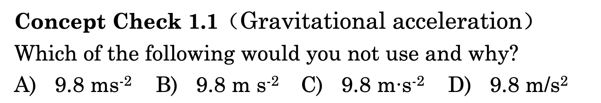
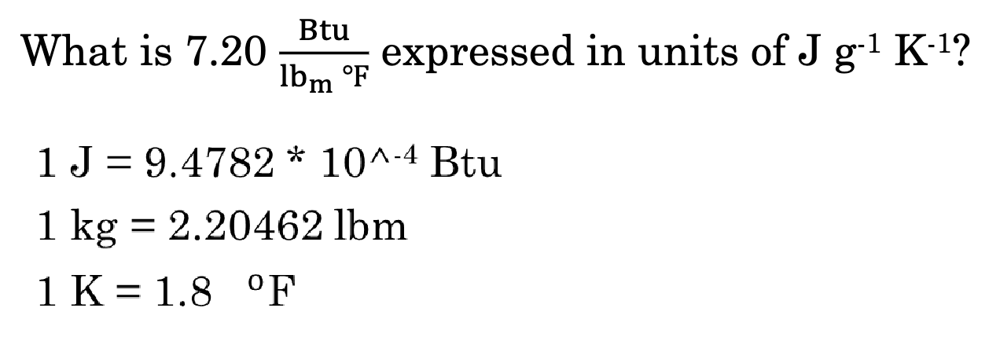
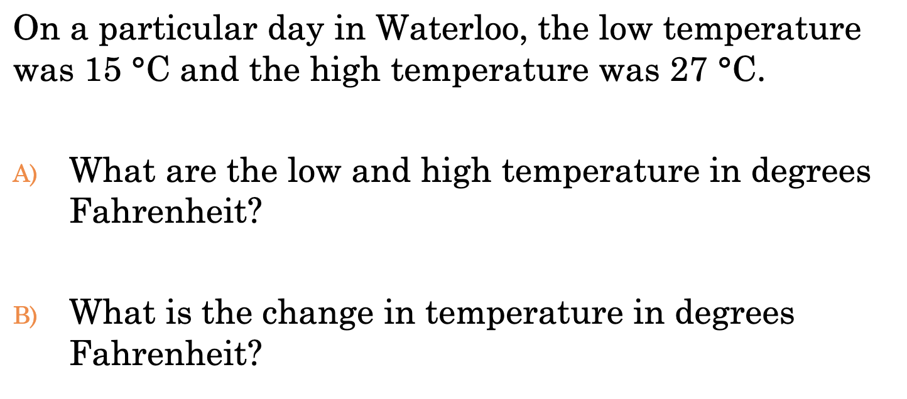

import Quiz from '../../../../src/components/Quiz.js'
import Desmos from '../../../../src/components/Desmos.js'

# Units

## Conversions

Simple dimentional analysis. See note for temperature conversions and review the quiz.

:::caution
$\frac{1\text{\degree C}}{1.8\text{\degree F}}$ is the ratio used for converting between Celsius and Fahrenheit **when the temperature is in an equation**. Equally, $\frac{1\text{\degree C}}{1\ \text{K}}$ is used for Celsius to Kelvin.
:::

## Desmos embed for your convenience!
<Desmos />

<Quiz correct="A">

</Quiz>

<Quiz answers={[
    "$30.1 \\frac{\\text{J}}{\\text{g} \\cdot \\text{K}}$",
    "$19.4 \\frac{\\text{J}}{\\text{g} \\cdot \\text{K}}$",
    "$53.2 \\frac{\\text{J}}{\\text{g} \\cdot \\text{K}}$",
    "$28.3 \\frac{\\text{J}}{\\text{g} \\cdot \\text{K}}$",
]}>

</Quiz>

<Quiz answers={[
    "A) $59\\degree \\text{F}$, $81\\degree \\text{F}$ B) $\\Delta = 22$",
    "A) $52\\degree \\text{F}$, $81\\degree \\text{F}$ B) $\\Delta = 25$",
    "A) $59\\degree \\text{F}$, $81\\degree \\text{F}$ B) $\\Delta = 21.6$",
    "A) $59.0\\degree \\text{F}$, $81\\degree \\text{F}$ B) $\\Delta = 21.6$",
]}>

</Quiz>

:::caution
Don't forget to keep your precision all the way through the problem. Only at the end do you round. This may have caused error in the previous question if you applied significant figures at the step of converting the temperature.
:::

