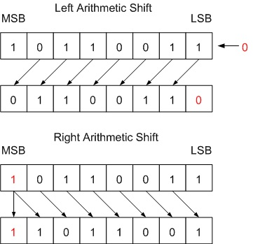
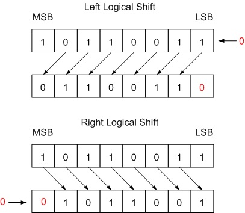

# Digital Computers

# *The cram*

## Arbitrary information:

1 question on classifying this. Free.
- PC
- Server
- Phone
- Microcontroller/embedded

Organization of a PC (5 items)
- Input
- Output
- Control: where the ops happen
- Datapath: control goes in, data goes in, data goes out
- Memory: where data is stored

ISA: Instruction Set Architecture defines
- Assembly language (which flavour and stuff)
- Operating modes
- Exception handling
- Spec that allows OS devs and and chip architects to work together
- Sidenote: actual chip devs make an uncanny amount of money

- Machine language: 010101001011101010101
- Assembly language: ADD R1, R2, R3

## Arithmetic

<details>
  <summary>Important POTs (powers of two) and powers of 16 to know.</summary>

Know these:

| Power of 16 | Value |
| ----------- | ----- |
| 0           | 1     |
| 1           | 16    |
| 2           | 256   |
| 3           | 4096  |
| 4           | 65536 |

| Power of 2 | Value |
| ---------- | ----- |
| 4          | 16    |
| 5          | 32    |
| 6          | 64    |
| 7          | 128   |
| 8          | 256   |
| 9          | 512   |
| 10         | 1024  |
| 11         | 2048  |
| 12         | 4096  |
| 13         | 8192  |
| 14         | 16384 |
| 15         | 32768 |
| 16         | 65536 |
| 32         | 4294967296 |
| 32  (÷2)       | 2147483648 |
| 32  (÷2 - 1)       | 2147483647 |

</details>

:::info
Important fact: one hexadecimal characters is 4 bits. This is called a nibble. Two nibbles makes a byte. Therefore, two hexadecimal characters make a byte. 

To convert hex to binary, just translate each character in hex to 4 binary bits.
:::

### Two's complement

- Define how many bits the number will be (required)
- Is MSB (most significant bit) 0? It's positive.
- Is MSB (most significant bit) 1? It's negative.

:::info
Negative binary -> negative decimal: add up all the place values, but add the MSB place as a negative.

Negative decimal -> negative binary: flip all bits, add 1, then convert to decimal.
:::

### Number ranges

- Unsigned: 0 to 2^n - 1
- Signed: -2^(n-1) to 2^(n-1) - 1

Basically for 8 bits:
- Unsigned: 0 to 255
- Signed: -128 to 127, take note of the fact the range is bigger on the negative side.

:::info
Overflow occurs: operands have the same sign and the result has a different sign.
:::

### Sign extension

Just means if you wanna take a 4 bit number and make it 32 bits, you just copy the MSB 28 times.

```
4 = 0100
4 = 00000000000000000000000000000100

-4 = 1100
-4 = 1111111111111111111111111111100
```

### Shifting

- Logical shift: shift in 0s either on the right or the left
- Arithmetic shift: shift in MSB when shifting right and 0s when shifting left






